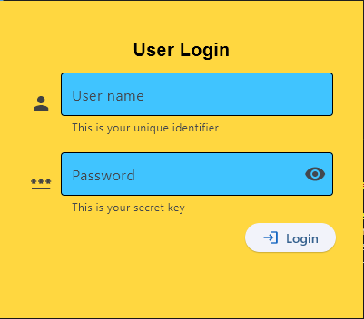
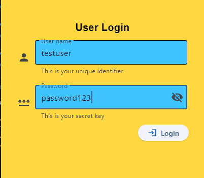
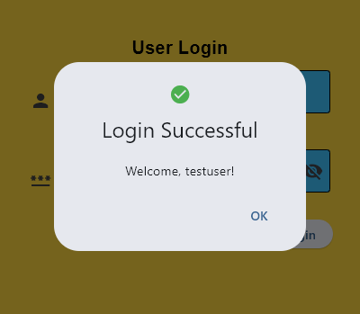
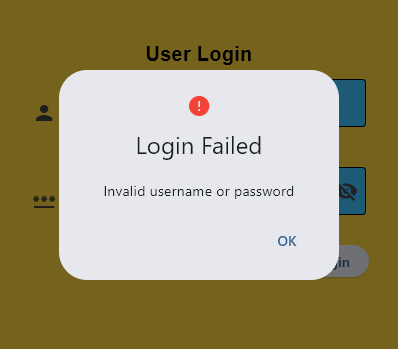
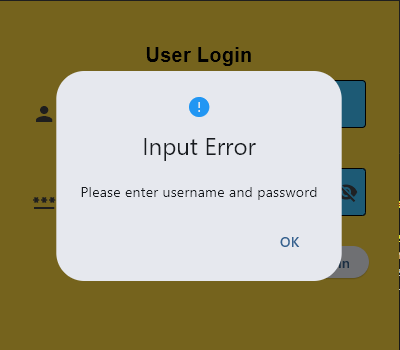
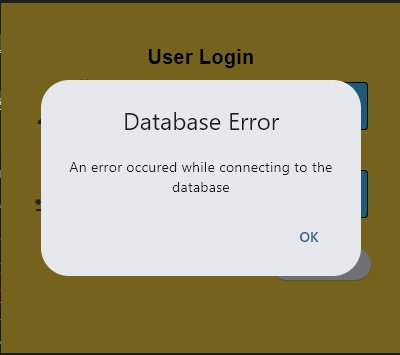

# Lab 3 Report: Flet User Login Application

**Student Name:** John Carlo E. Nas

**Student ID:** 231002281

**Section:** 3A

**Date:** 9/20/2025


## I. Objective

Create a simple user login application using the Flet framework. This exercise covers building a user interface, handling user input, and connecting to a MySQL database for authentication.

## II. Prerequisites

- Python 3.x
- Flet 0.28.3
- MySQL Connector for Python
- A running MySQL server instance (XAMPP Server)

## III. Setup Instructions

### 1. Project Setup

```sh
mkdir week3_labs
cd week3_labs
flet create --project-name userlogin
```

### 2. Install Required Packages

```sh
pip install flet mysql-connector-python
```

### 3. Database Setup

- Create a database and table in MySQL:

```sql
CREATE DATABASE fletapp;
USE fletapp;
CREATE TABLE users (
	id INT AUTO_INCREMENT PRIMARY KEY,
	username VARCHAR(255) NOT NULL UNIQUE,
	password VARCHAR(255) NOT NULL
);
INSERT INTO users (username, password) VALUES ('testuser', 'password123');
```

- Update `src/db_connection.py` with your MySQL credentials:
  - host: "localhost"
  - user: "root"
  - password: "admin123" (replace with your password)
  - database: "fletapp"

## IV. Application Structure

- `src/main.py`: Main UI and login logic
- `src/db_connection.py`: Database connection helper

## V. Features

- **Login UI**: Username and password fields, login button
- **Dialogs**:
  - Success: Welcome message
  - Failure: Invalid credentials
  - Input Error: Missing fields
  - Database Error: Connection issues

## VI. Running the Application

1. Open a terminal in the project root.
2. Run the app:

```sh
flet run
```

## VII. Expected Output

- **Window**: Centered, frameless, amber background, "User Login" title
- **Login**:
  - Correct credentials: "Login Successful" dialog
  - Incorrect credentials: "Login Failed" dialog
  - Empty fields: "Input Error" dialog
  - Database issues: "Database Error" dialog

## VIII. Screenshots

**User Login Blank**




**User Login Entry**




**Login Successful**




**Login Failed**




**Input Error**




**Database Error**

