# Lab 4 Report: Contact Book Application Enhancement

**Student Name:** John Carlo E. Nas

**Student ID:** 231002281

**Section:** 3A

**Date:** 9/21/2025

## I. Objective

Enhance a Contact Book application using Flet, implementing CRUD operations, input validation, confirmation dialogs, search/filter functionality, and theming (light/dark mode).

## II. Prerequisites

- Python 3.x
- Flet 0.28.3
- SQLite3

## III. Setup Instructions

### 1. Project Initialization

```sh
cd week4_labs
flet create contact_book_app
cd contact_book_app
```

### 2. Create Python Files

- `main.py`: Main UI file (already exists)
- `database.py`: Database layer
- `app_logic.py`: Application logic

### 3. Install Required Packages

Flet and SQLite3 are required. SQLite3 is included with Python.

```sh
pip install flet
```

## IV. Application Structure

- `main.py`: Builds the window and UI components
- `database.py`: Handles database operations (init, add, update, delete, fetch)
- `app_logic.py`: Connects UI actions to database functions

## V. Features

- **Home UI**: Main screen with contact list and add contact form
- **Show Menu**: Popup menu for each contact (Edit/Delete)
- **Search**: Search/filter contacts by name
- **Add Contact**: Add new contact
- **Edit Contact**: Edit existing contact
- **Confirm Delete**: Confirmation dialog before deleting
- **Contact Added/Deleted/Updated**: Feedback dialogs
- **Input Error**: Prevent adding contact with empty name
- **Theming**: Toggle between light and dark mode

## VI. Running the Application

1. Open a terminal in the `contact_book_app` directory.
2. Run the app:

```sh
flet run
```

For mobile/web testing:

```sh
flet run --android
flet run --web
```

## VII. Expected Output

- **Home UI**: Displays contact list and add contact form
- **Show Menu**: Edit/Delete options for each contact
- **Search**: Filters contacts in real-time
- **Add/Edit/Delete Contact**: Updates contact list
- **Input Error**: Shows error if name is empty
- **Confirm Delete**: Asks before deleting a contact
- **Theming**: Switch between light and dark mode

## VIII. Screenshots

**Home UI**

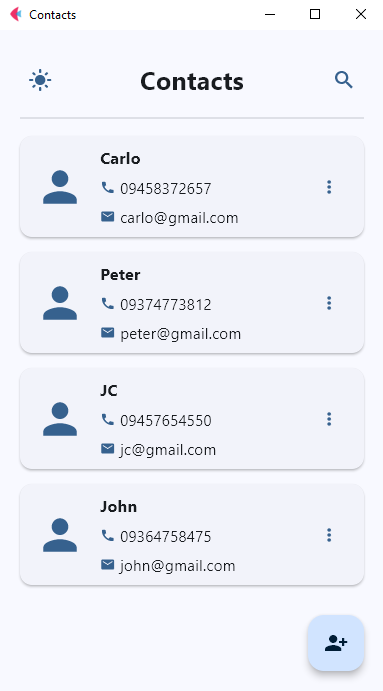  
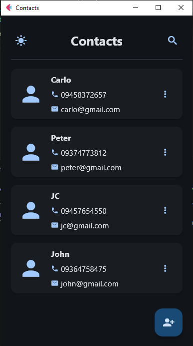  


**Show Menu**

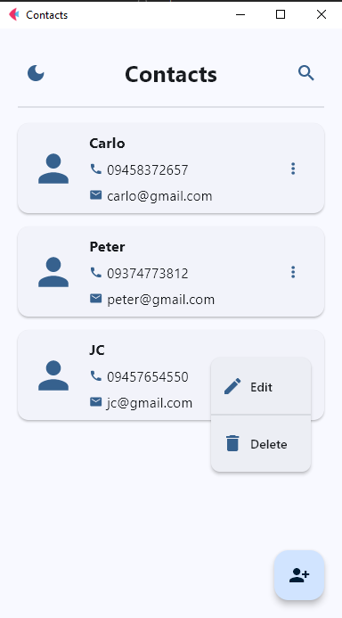
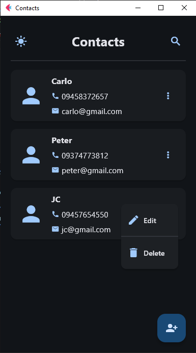 


**Search**

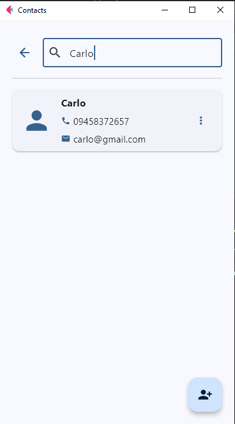
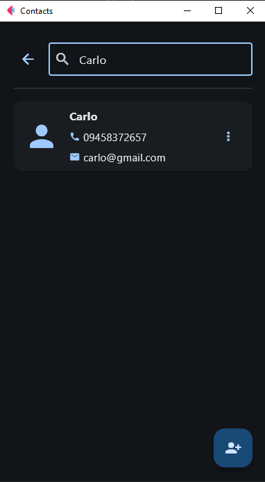 


**Add Contact**


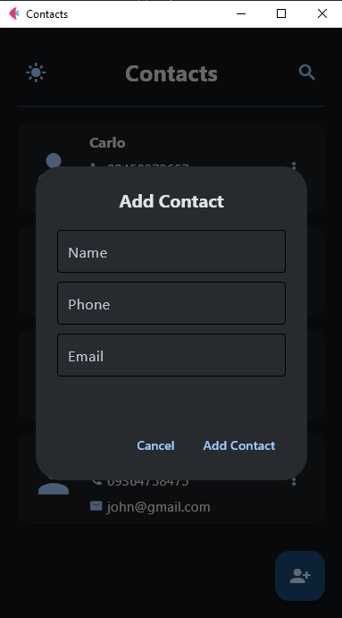


**Edit Contact**

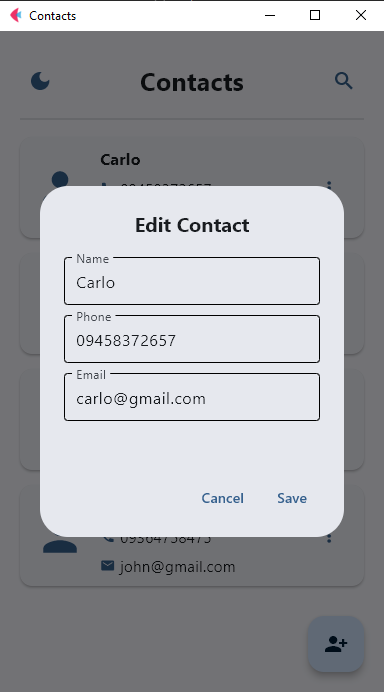
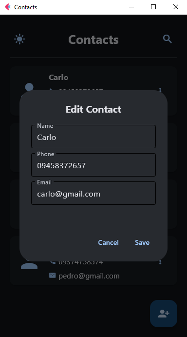


**Delete Confirmation**

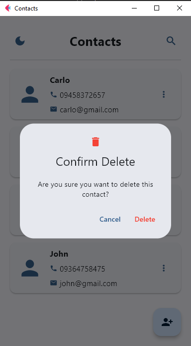
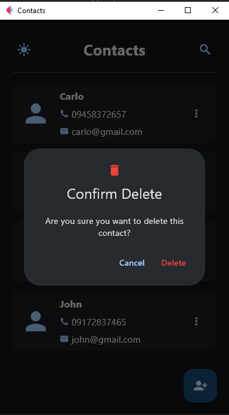


**Contact Added**

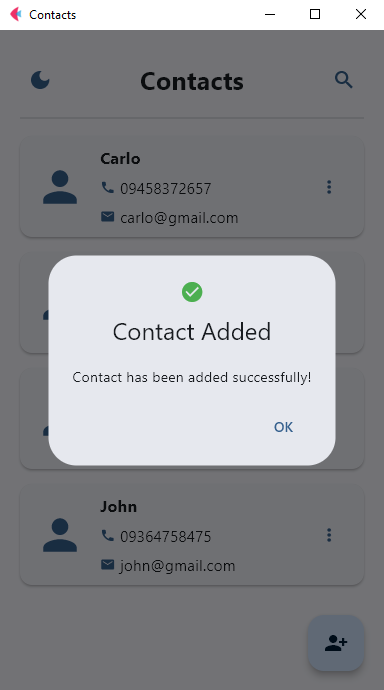
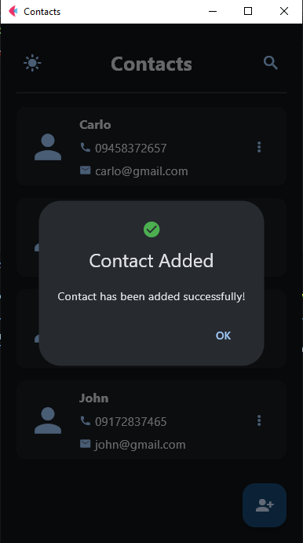 


**Contact Deleted**

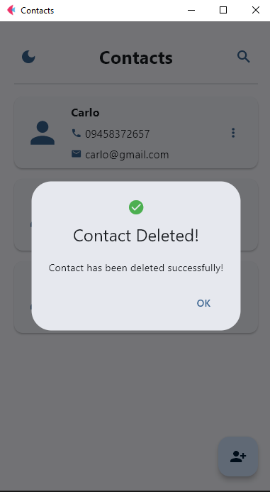
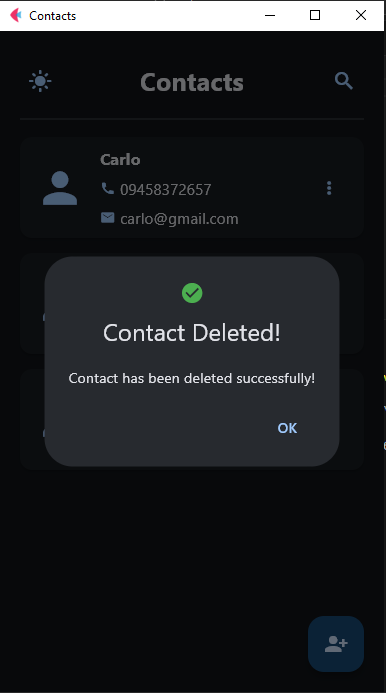


**Contact Updated**

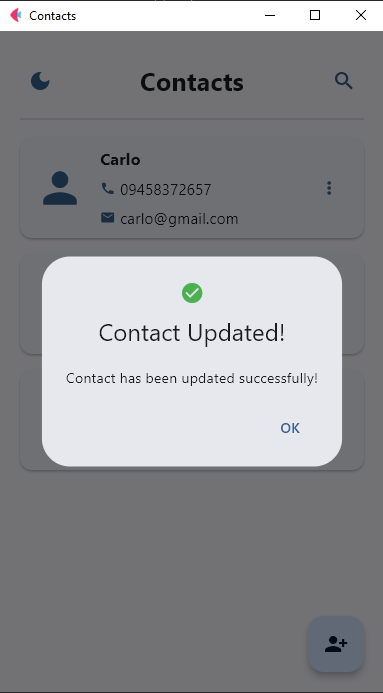
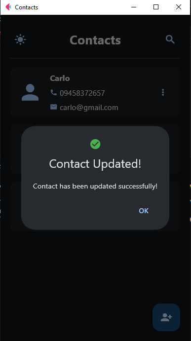


**Input Error**

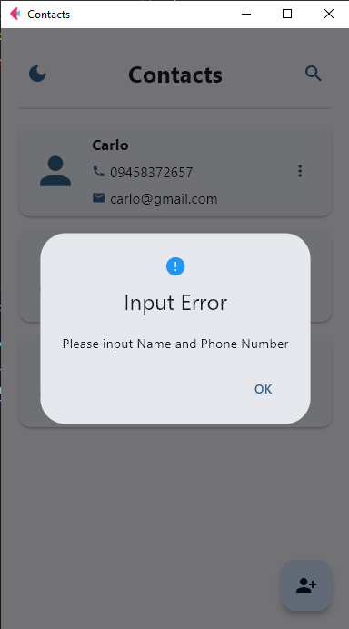
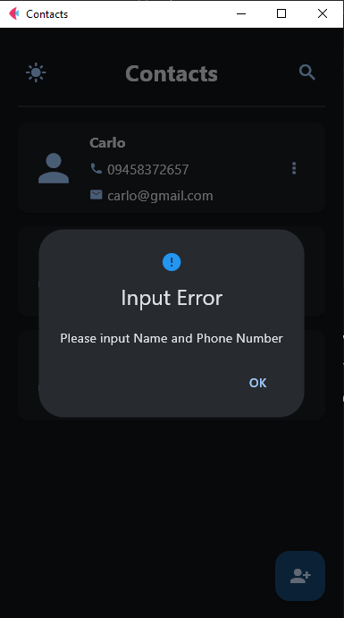         |


## IX. Additional Learning Tasks

1. **Input Validation**: Prevent adding contacts with empty names. Shows error message.
2. **Confirmation on Delete**: Confirmation dialog before deleting a contact.
3. **Search/Filter Functionality**: Real-time search/filter for contacts.
4. **Theming (Dark Mode)**: Toggle between light and dark mode.
5. **Refine the UI**: Use cards and icons for a modern look.

---

For more details, refer to the source code and screenshots in the `lab4_screenshots` folder.
